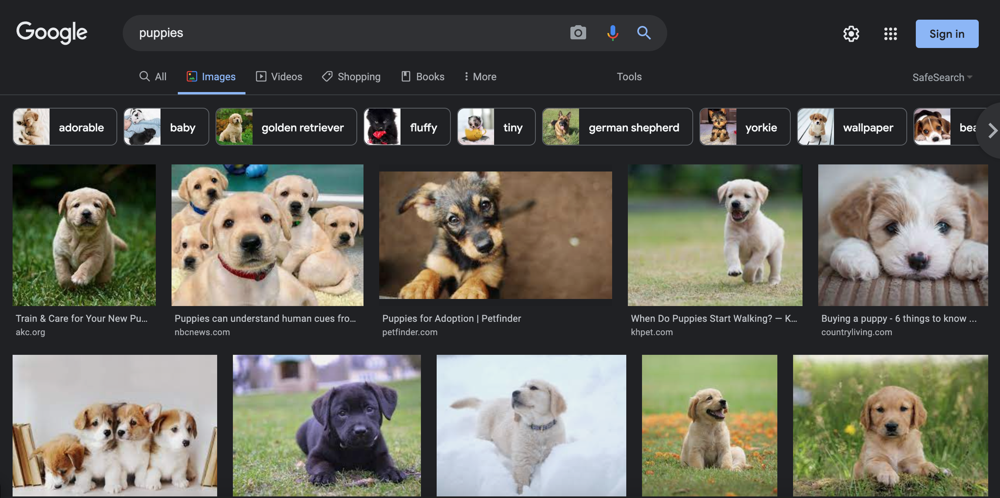
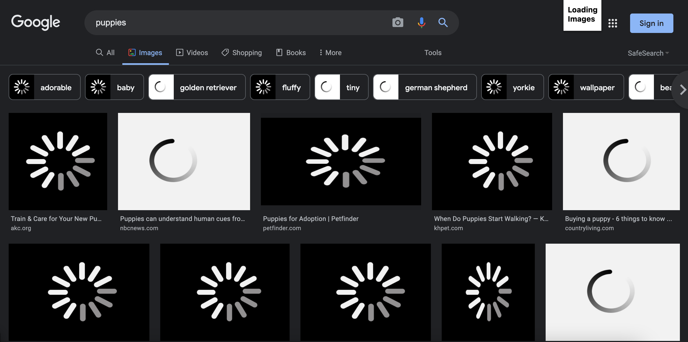

For me, one of the most annoying things is when I'm trying to search for an image on a website/ through Google, only for it to be stuck loading for almost a million years (give or take). So, for Mini Project 4, I thought that the perfect way to bug the user would be to make an extension that would replace all of the images on the screen with two different "loading" images when you click it :)
