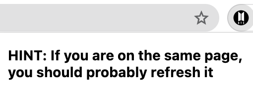
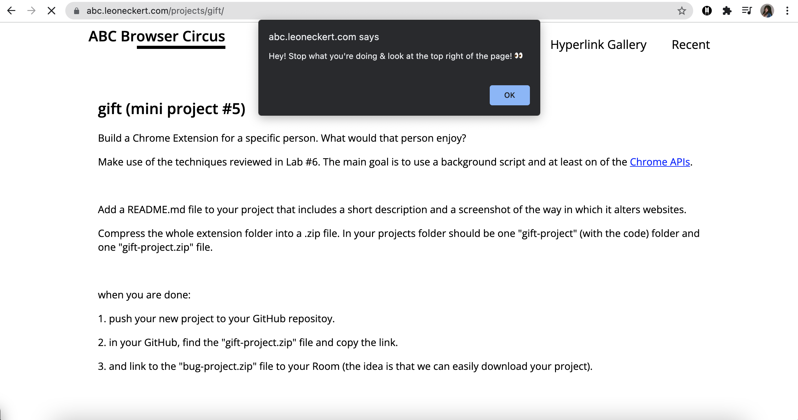
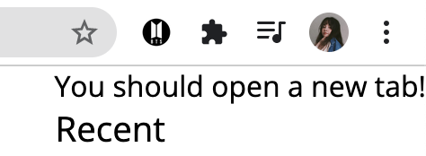

# gift-project
## Why I made this extension
I made this extension with my sister in mind. I became a fan of BTS back in 2015, and ever since then she kept saying that she would "never ever be a fan of them". Fast forward to the peak of the COVID-19 pandemic, and she became a massive BTS super-fan.

She also spends a lot of time on her computer studying, so I figured an extension like this would totally annoy her at first (with the alert and following the message trail), but upon realizing it just shows her pictures of BTS, it would have been worth it.

I did show her the final product when it was done, and that's basically exactly what happened. She really liked it though, and kept opening new tabs to see all the pictures.

## How does it work?
 
Firstly, if the user remains on the same page, clicking the extension icon will bring up a popup window. This popup window gives a little hint as to what they should do next. 

 
Refreshing the page allows the alert message to show, which further prompts the user to look for another hidden message, it's like following a paper trail (in this case, a digital trail?) of messages. 

 
The message that subtly pops up tells the user to open a new tab... 

 
And finally, the heart of the extension is that whenever the user tries to open a new tab, they are met with a random image of BTS instead. This was done using [overriding chrome pages](https://developer.chrome.com/docs/extensions/mv3/override/) that is related to the bookmark and tab API's. The cursor transforms into the group's light stick that fans use in concerts.
