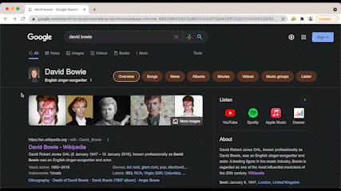
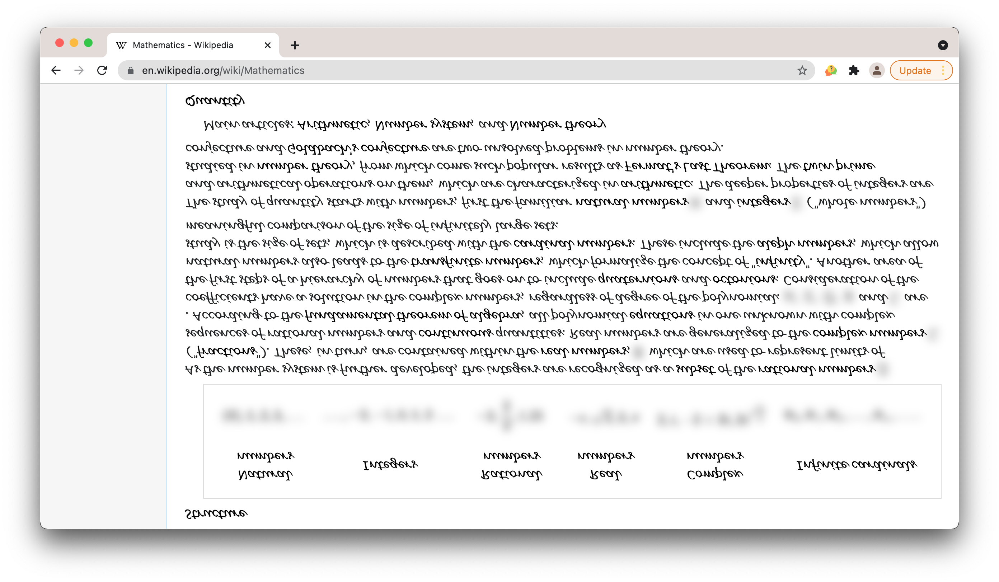
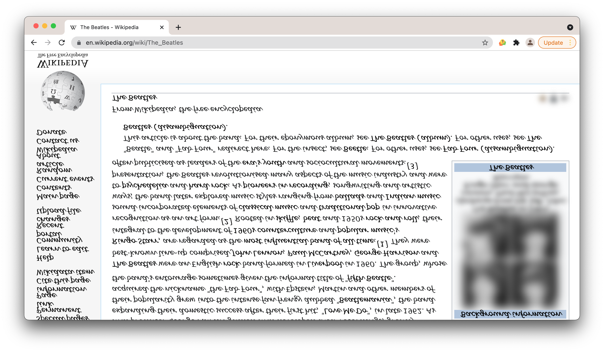
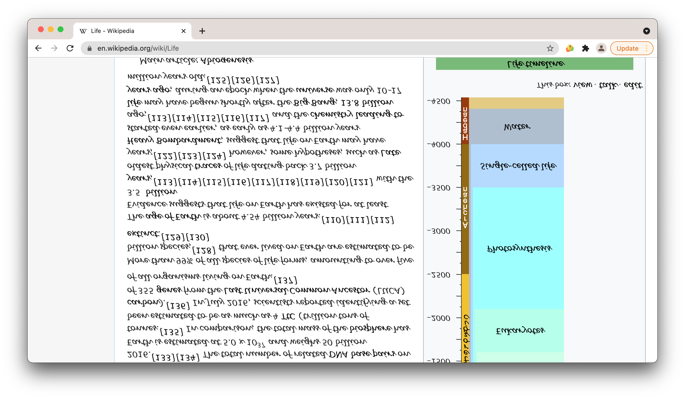

# Wikillegible

## About the extension
Wikillegible is an extension that makes Wikipedia illegible! By transforming the text to make it look like a foreign language and blurring the visual elements, it turns Wikipedia into this strangely-familiar, yet completely unrecognizable site. Download the extension [here](https://github.com/piinkoon/abc-student-repo/blob/master/projects/projectB/wikillegible.zip) to see the interesting visuals, or  secretly download it onto your friend's computer to pull a clever prank!

## Technical Experience and Reflection
Overall, I had a reasonably challenging experience with this project. Out of all of the coding I've had to do thus far (which isn't that much in the first place) extensions were definitely the most intense to learn about and figure out. It took a lot of time to understand them and get them working (kind of) in the way I wanted to. For this project, I ended up changing my idea. The reason why is because I wanted to create a garish project with a really absurd look, and an extremely annoying vibe. The first idea I had, I felt didn't do this enough. As a result of becoming more unsure of that first idea, the more I came to dislike it and feel stressed. So, I took a step back and focused on doing something else to accomplish my original goal, and decided to make Wikillegible! I transformed as many elements as possible using querySelectorAll() and tried to make Wikipedia look as insane as possible. I was also going to do something with span tags and have the user mess up the text when they scrolled or used their mouse, but eventually decided that was probably too much. In the end, I'm just really glad I made an extension that A) works and B) looks/ has the effect that I wanted in the first place!

## More screenshots

