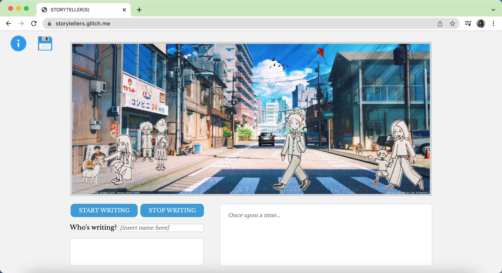
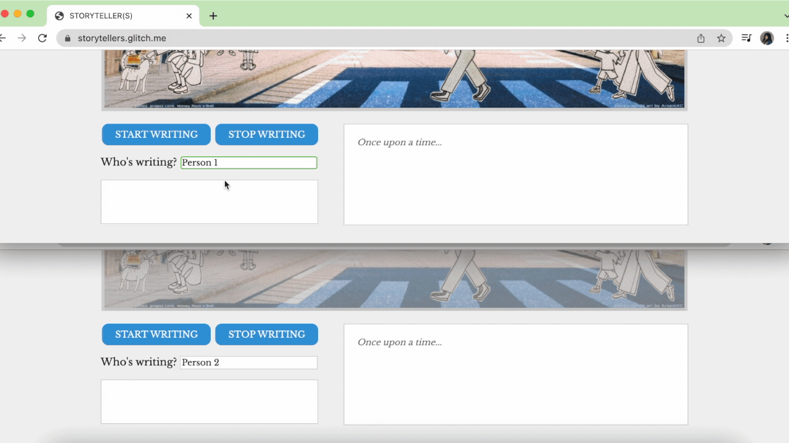

# STORYTELLER(S)

## Introduction and Features
STORYTELLER(S) is a realtime collaborative editor that allows for a user, either on their own or with others, to join together on one space and take turns writing a story. There is a reference photo in the middle of the screen, in which there are multiple characters and events taking place within it. The user(s) can refer to that photo, and create a storyline around those characters and the situations they find themselves in. Who is this person? Who are they talking to? How will they interact with that other character over there? Those are the kinds of questions the user(s) can keep in mind as they design their story.

When the users want to start writing, they input their name and click "Start Writing!" in order to edit the main text area. When they are done, they click the "Stop Writing!" button to allow someone else to edit.

There is also an information button in the top left, that explains the overall purpose and functions of the project as well. Next to it is a save button, that will save the content of the main text area to a database.
### Inspiration
In the end, I was inspired by the prompt from Project A to make this project, specifically when it referred to the browser being a space in which one can tell a story. I carried visual aesthetics from that project onto this one as well!
### See for Yourself!
Access the project through glitch [here](https://storytellers.glitch.me/) to see the project in all its glory, and have fun becoming a storyteller!

## Experience and Reflection
### Technical Details
Overall, the project uses Express, socket.io, and firebase-admin in order to establish a connection between multiple clients and a server, and to a firebase database as well. The input within the text area (where the story is written) is broadcast to all of the clients on the project page, allowing for realtime editing. The "Start Writing!" and "Stop Writing!" buttons have functions in themselves, in which they emit a message to all of the clients indicating when a user is taking their turn, and also enable/ disable the readonly attribute of the text area. The "Who is writing?" input takes whatever name/ nickname is typed in, and attaches it to the front of the message that is emitted. The final technical function is the save button, in which the button pushes all of the data inputed into the text area to a firebase database.
### Problems and Compromises
In hindsight, I think my biggest downfall was being too ambitious while also having practically no time to be able to work on completing all of the original goals I had for this project. For example, I originally wanted to have multiple people edit the text area at once, and to be able to see all of the cursors typing away in one place. Unfortunately, after the result of Mini Project 7, I found that having multiple cursors within one text input isn't a possible functionality for them at all currently. So, I had to fix that problem by adding in the button system and enabling/ disabling the readonly attribute of the text area itself. I figured that would be a tolerable solution, and also introduces a layer of communication between the users and allows them to find a way to take turns.
Furthermore, I also wanted to have multiple images, and set out to make three. Unfortunately, I underestimated how long it would take me to draw certain elements of the images, scan them, and edit everything together. So, in the end I was left with one and a half drawings done, and had to compromise by only including the finished one.
Finally, my last compromise was with the database, which is probably what I spent the most time on sorting out with my professor and another classmate. I wanted to have the data (in this case, the text written in the text area) be shown in a popup window when the save button was clicked (similar to the information button), but did not have the time to sort that out and have it done by the due date.
